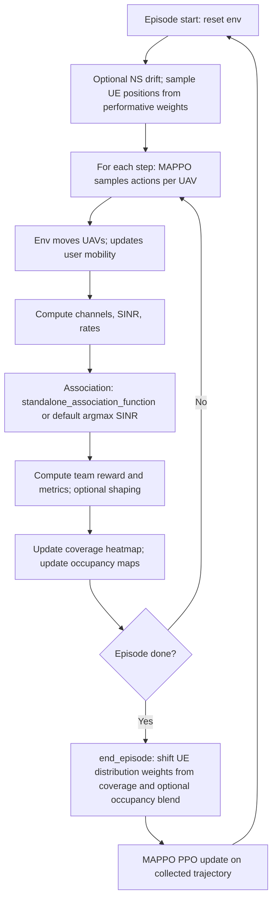

# PerformativeMFMARL and PerformativeMARL

This note documents the two **MAPPO-based** proposed methods used in the performative multi-UAV experiments (formerly referred to as *AdaptiveMAPPO* and *AdaptiveMAPPO_NoMF*). Both share the same **action space**, **team reward**, and **training loop**; they differ only in **which spatial fields are included in each agent’s observation** and in how the **mean-field–style** side information is presented to the policy.

Implementation lives in `rl_agent/marl_env.py` (MDP), `rl_agent/MAPPO.py` (learner), `rl_agent/AdaptiveNonStationaryMARL.py` (`standalone_association_function` injected into the env), `compare_all_rl_convergence.py` (`train_model`), and `run_rl_comparison_500ep.py` (full baseline comparison).

**Note:** `compare_all_rl_convergence.py`’s `main()` trains **PerformativeMFMARL** only as a quick demo; the **two-variant** study (PerformativeMFMARL vs PerformativeMARL) is in `run_rl_comparison_500ep.py`.

---

## What we added (summary)

1. **Performative feedback loop** — UE placement weights adapt to historical coverage (and optionally to UAV grid occupancy), so the data distribution depends on long-run policy behavior.
2. **Non-stationary context** — Optional drift in traffic demand and channel-related parameters; seven global scalars replicated in every agent’s observation block when enabled.
3. **Signal-map observations** — A low-dimensional **per-cell** map of best-server received power (normalized), without exposing raw UE coordinates (mean-field style shared field).
4. **Occupancy map observations (PerformativeMFMARL only in the 500-ep runner)** — Normalized per-cell UAV visitation, appended to each agent block when enabled.
5. **Reward shaping** (proposed runs in `run_rl_comparison_500ep.py`) — Handover penalty, movement penalty, and spread bonus on top of throughput and QoS.
6. **Adaptive UE–UAV association** — Both proposed methods register `AdaptiveNonStationaryMARL.standalone_association_function()` so the env uses a rule-based association that considers SINR, performative heatmap, mobility, LoS, and load (instead of pure argmax-SINR).

---

## Action space

- **Type:** `gymnasium.spaces.MultiDiscrete([6] * num_uavs)`.
- **Semantics:** Each UAV picks one of six moves every step: **0 up, 1 down, 2 left, 3 right, 4 forward, 5 backward** (see `MARLEnv.step`).
- **Physics:** Positions are clipped to the grid; UAV height is clamped to **[5, 50]** m after each move.
- **Identical** for PerformativeMFMARL, PerformativeMARL, and all baselines.

---

## Observation / state space

The global vector is the **concatenation of one block per UAV** (decentralized execution: each agent reads its own block from the sliced observation in MAPPO).

Per-UAV block layout:

| Segment | Condition | Content |
|--------|-----------|---------|
| Pose | Always | `(x_i, y_i, z_i)` for UAV `i` |
| Signal map | `enable_signal_map_obs=True` | Flattened `10×10` grid: per cell, max over UEs in that cell of **best-server linear received power**, divided by global max → roughly **[0, 1]** |
| Occupancy map | `enable_occupancy_obs=True` | Flattened `10×10` grid of **normalized UAV visitation** (same spatial resolution as the signal map) |
| NS context | `enable_non_stationary=True` | **Seven** scalars (episode index scale, traffic drift, sin/cos phase features, mobility aggregates), **replicated** in every agent’s block |

**Dimension:**

`agent_obs_dim = 3 + (100 if signal map) + (100 if occupancy) + (7 if non-stationary)`  

`observation_space.shape[0] = num_uavs * agent_obs_dim`.

**PerformativeMFMARL** (in `run_rl_comparison_500ep.py`): non-stationary + performative + **signal map on** + **occupancy obs on** + **occupancy blended into performative UE updates** + shaped reward.

**PerformativeMARL** (ablation): same as above except **`enable_signal_map_obs=False`** and **`enable_occupancy_obs=False`**, so each block is **pose + NS context only** (smaller `agent_obs_dim`). Performative dynamics and association rule are unchanged; the policy no longer sees the shared radio / occupancy fields.

---

## Reward

At each step the env computes a **scalar team reward** (shared by all agents for MAPPO). From `_calculate_reward_and_metrics`:

| Component | Formula / note |
|-----------|----------------|
| Throughput | `sum` of served user rates (with traffic multiplier if non-stationary), scaled as `total_throughput / 1e6` (Mbps-scale) |
| QoS bonus | `qos_bonus * (qos_satisfied_users / num_users)` where QoS is `rate >= min_user_rate * 1e6` (bps) |
| Collision | Adds `collision_penalty` (large negative) if any UAV pair is closer than **1 m** |
| Handovers | Subtracts `handover_penalty * handovers` (association changes vs previous step) |
| Motion | Subtracts `movement_penalty * sum_i ||Δp_i||` (L2 displacement after clip) |
| Spread | Adds `spread_bonus * mean` pairwise **ground** distance between UAVs |

Default shaping weights are **0**; the 500-episode proposed configs set non-zero handover / movement / spread weights via `_build_env(..., shaped=True, ...)`.

`info` also carries throughput, fairness, user rates, handover count, energy accounting, etc., for logging and publication plots.

---

## Algorithm flow (both proposed methods)

The following applies to **PerformativeMFMARL** and **PerformativeMARL**; the only difference is whether the observation includes the signal (and occupancy) maps.



**Training:** `train_model` in `compare_all_rl_convergence.py` rolls out episodes, accumulates per-episode throughput / return / goodness / energy metrics, and calls `env.end_episode()` where performative mode is enabled. For MAPPO-family agents named `PerformativeMFMARL` or `PerformativeMARL`, the env’s association function is set from `AdaptiveNonStationaryMARL.standalone_association_function()`.

---

## Naming and legacy artifacts

- Code and new result files use **`PerformativeMFMARL`** and **`PerformativeMARL`**.
- Older runs may still store **`AdaptiveMAPPO`** / **`AdaptiveMAPPO_NoMF`** in `rl_results.json` or under `checkpoints/AdaptiveMAPPO*/`. Plotting helpers (`make_final_figures.py`, `replot_from_checkpoints.py`) map those legacy keys to the new names so figures stay consistent without retraining.

---

## Quick reference: where each variant is built

| Variant | Typical flags (`run_rl_comparison_500ep.py`) |
|---------|-----------------------------------------------|
| **PerformativeMFMARL** | `shaped=True`, `use_occupancy_performative=True`, `enable_occupancy_obs=True`, `enable_signal_map_obs=True` |
| **PerformativeMARL** | Same, but `enable_occupancy_obs=False`, `enable_signal_map_obs=False` |

Regenerate publication-style PNGs from a saved aggregate JSON:

```bash
MPLBACKEND=Agg python3 make_final_figures.py \
  --results figures/convergence_2000ep_pub_tuned/rl_results.json \
  --out-dir final_figures
```
