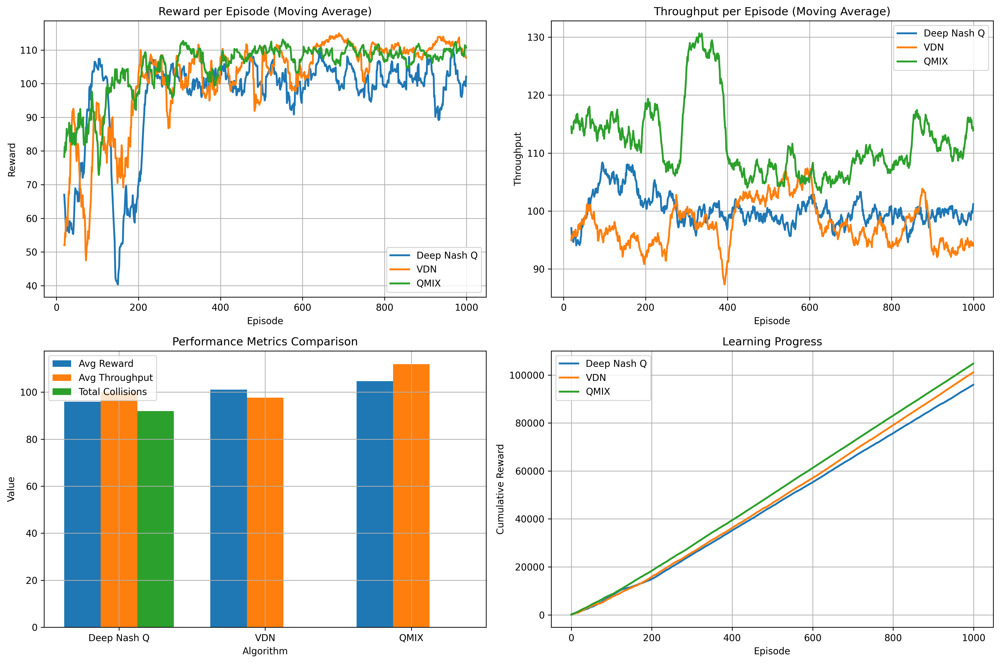

# 🚁 UAV-Assisted Wi-Fi Coverage Optimization using Multi-Agent Reinforcement Learning

> **Multi-agent reinforcement learning (MARL) meets UAV-based Wi-Fi coverage.** This repository implements Deep Nash Q-learning, QMIX, and VDN algorithms to optimize UAV positioning and user association, outperforming deterministic models under mobility and interference.
---

## 📄 Paper Summary

**📝 Title:** Optimizing Throughput in Wi-Fi enabled UAV Network using Multi-agent Reinforcement Learning  
**👥 Authors:** Parshav Pagaria, Dhruv Mishra, Souvik Deb, Santosh Nagraj, Mahasweta Sarkar, Shankar K. Ghosh  
**🏛️ Affiliations:**  
- San Diego State University, USA  
- Shiv Nadar Institution of Eminence, India  

**🔍 Abstract:**  
This paper introduces a **decentralized MARL framework** to optimize UAV positions and user association in **Wi-Fi-enabled aerial networks**. The environment includes UAV collisions, handover frequency, and transmission failures. Three MARL models—**VDN**, **QMIX**, and **DeepNashQ**—were compared with two deterministic baselines. Results show that **QMIX consistently achieves superior throughput, fairness, and minimum user rate** under user mobility and interference.

📌 **Best Performer:** QMIX  
📌 **Key Metrics:** Throughput, LBT, Goodness  
📌 **IEEE Standard:** 802.11ac (Wi-Fi 5)  
---

## 📁 Project Structure
├── train.py # Deep Nash Q-learning agent 

├── train_qmix.py # QMIX algorithm

├── train_vdn.py # VDN algorithm

├── model.py # SINR-based deterministic strategy

├── abid_model.py # Custom baseline (Deterministic II)

├── compare_models.py # Generate performance plots

├── results/ # Raw data and plot images (.npy, .png)

├── requirements.txt # Python dependencies

├── LICENSE, Makefile, .gitignore


---

## 🧠 Problem Statement

Positioning UAVs for **Wi-Fi coverage** and user association is challenging due to:
- 🌀 User mobility
- 📶 Inter-UAV interference
- 📡 Real-time throughput and fairness constraints

We aim to:
- Maximize **system throughput**
- Optimize **worst-case user experience**
- Evaluate learning-based vs rule-based UAV coordination

---

## 🔍 Algorithms Compared

| Model              | Type              | Description |
|-------------------|-------------------|-------------|
| **Deep Nash Q**    | Game-Theoretic MARL | Learns Nash equilibrium strategies for cooperative behavior |
| **QMIX**           | Value-based MARL   | Nonlinear value mixing for complex agent interactions |
| **VDN**            | Value-based MARL   | Linear decomposition of Q-values per agent |
| **Deterministic I**| SINR-based         | Greedy placement with static strategy |
| **Deterministic II**| Geometry-based     | Circle-packing trajectory baseline |

---

## 📊 Evaluation Metrics

| Metric             | Description |
|--------------------|-------------|
| 📶 **Total Throughput** | Sum of all user data rates |
| ⬇️ **Minimum User Rate (LBT)** | Worst-case UE experience |
| 💡 **Goodness** | Fraction of UEs above throughput threshold |
| ❌ **Collision Count** | UAV physical overlap incidents |

---

## 🖼️ Visual Results

### Learning Curves and Performance Summary


---

## 🚀 Getting Started

### 🔧 Setup Environment
```bash
pip install -r requirements.txt

🏋️ Train RL Models

python train.py        # Deep Nash Q
python train_qmix.py   # QMIX
python train_vdn.py    # VDN

🔬 Run Baseline Models

python model.py        # Deterministic I
python abid_model.py   # Deterministic II

📈 Compare Models
python compare_models.py
📁 Plots and data saved in /results

📦 Dependencies

Python 3.8+
PyTorch ≥ 1.9.0
Gymnasium ≥ 0.26.0
NumPy, Matplotlib, Pandas, SciPy, tqdm
pip install -r requirements.txt

🔬 Simulation Environment

3D grid: 10×10×5 m³
UAVs fly at fixed altitudes (10m, 15m)
Wi-Fi standard: IEEE 802.11ac (CSMA/CA)
Dynamic UE mobility (random waypoint)
TDMA-based user scheduling
Evaluation over 1000+ episodes with statistical significance
```
📚 References

IEEE 802.11ac Wi-Fi standard
Jain’s Index for Fairness [DEC TR-301]
QMIX [ICML 2018], VDN [AAMAS 2018], Deep Nash Q-learning [JMLR 2003]
Bianchi’s model for 802.11 throughput analysis

🪪 License

This repository is licensed under the MIT License. See LICENSE for details.

🙌 Acknowledgements

We thank the research advisors and collaborators from SDSU and Shiv Nadar Institution of Eminence for their guidance.

🔗 Citation

If you use this code or paper in your work, please cite:

@article{pagaria2025uav,
  title={Optimizing Throughput in Wi-Fi enabled UAV Network using Multi-agent Reinforcement Learning},
  author={Pagaria, Parshav and Mishra, Dhruv and Deb, Souvik and Nagraj, Santosh and Sarkar, Mahasweta and Ghosh, Shankar K.},
  journal={arXiv preprint arXiv:XXXX.XXXXX},  
  year={2025}
}
